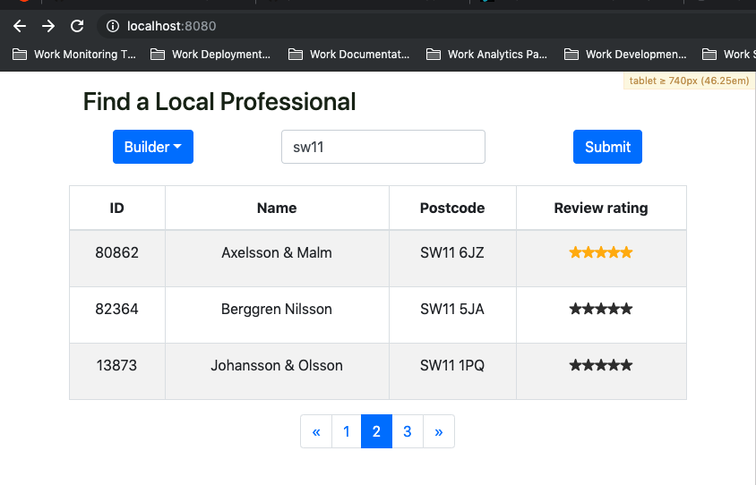

# Professional Finder App

### Written using React and Redux running on a Node Express server.

See the finished project running on Google Cloud here: https://professional-finder-app.appspot.com/

To use:
- `npm install`
- `npm run webpack`
- `npm start`

Watchers:
- `npm run webpack:watch`
- `npm run test:watch`

To test:
- `npm test`

Notes:
- Started out TDD then this became time consuming *please check out the unit tests, I think they get overlooked, and they take ages to write*
- Used React, Redux, `react-redux`, Context API, [`redux-promise-middleware`](https://github.com/pburtchaell/redux-promise-middleware) for async calls, React Bootstrap, Axios and and sass-mq
- Setup my own Webpack and Babel configs.
- Took more time on this just as an opportunity to practice
- Added loading state and spinner
- Added error messaging for validation failures.

Screenshot:

